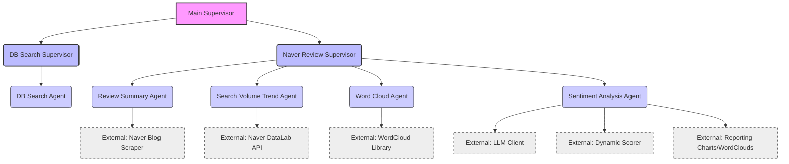

# Tour Agent: 계층적 LangGraph 기반 여행 정보 분석 에이전트

## 프로젝트 소개

`Tour Agent`는 LangGraph를 활용하여 계층적 에이전트 구조로 설계된 여행 정보 분석 시스템입니다. 사용자가 입력한 축제 정보에 대해 데이터베이스 검색, 네이버 블로그 리뷰 요약 및 꿀팁 제공, 검색량 트렌드 그래프, 워드 클라우드, 감성 분석 등 다양한 정보를 제공합니다. 클린 아키텍처 원칙을 적용하여 모듈성과 확장성을 높였습니다.

### 사용자에게 제공하는 가치

이 애플리케이션은 여행 계획을 세우거나 특정 축제에 대한 심층적인 정보를 얻고자 하는 사용자에게 다음과 같은 가치를 제공합니다:

*   **맞춤형 축제 정보:** 지역 및 카테고리별 필터를 통해 관심 있는 축제를 쉽게 찾을 수 있습니다.
*   **실시간 리뷰 분석:** 네이버 블로그의 최신 리뷰를 분석하여 축제의 장단점, 방문 팁, 분위기 등 생생한 정보를 얻을 수 있습니다.
*   **시장 트렌드 파악:** 축제 관련 검색량 트렌드를 통해 대중의 관심도를 시각적으로 파악하고, 방문 시기를 결정하는 데 도움을 받을 수 있습니다.
*   **핵심 키워드 시각화:** 워드 클라우드를 통해 축제 리뷰에서 자주 언급되는 핵심 키워드를 한눈에 파악하여 축제의 특징을 빠르게 이해할 수 있습니다.
*   **객관적인 감성 분석:** 리뷰에 대한 긍정/부정 감성 분석 결과를 통해 축제에 대한 전반적인 평가와 구체적인 불만 사항을 객관적으로 확인할 수 있습니다.
*   **의사 결정 지원:** 이 모든 정보를 종합하여 사용자가 보다 합리적이고 만족스러운 여행 계획을 세울 수 있도록 돕습니다.

## 주요 기능 (Features)

`Tour Agent`는 다음과 같은 핵심 기능을 제공합니다:

1.  **축제 정보 검색:**
    *   지역(시/도, 시/군/구) 및 카테고리(대분류, 중분류, 소분류) 필터를 사용하여 원하는 축제를 검색합니다.
    *   검색된 축제 목록을 페이지네이션하여 제공합니다.
2.  **축제 상세 정보 조회:**
    *   선택한 축제의 기본 정보(주소, 전화번호), 상세 정보(시작일, 종료일, 장소), 개요 및 행사 내용을 표시합니다.
3.  **네이버 리뷰 요약 및 꿀팁:**
    *   선택한 축제에 대한 네이버 블로그 리뷰를 스크래핑하여 LLM 기반으로 핵심 내용을 요약하고 방문 팁을 제공합니다.
4.  **검색량 트렌드 그래프:**
    *   네이버 데이터랩 API를 활용하여 축제명에 대한 최근 1년간의 검색량 트렌드 그래프를 생성합니다.
    *   축제 시작일을 중심으로 한 특정 기간의 검색량 트렌드도 함께 제공합니다.
5.  **워드 클라우드 생성:**
    *   네이버 블로그 리뷰 텍스트에서 명사를 추출하고 불용어를 제거하여 워드 클라우드를 생성합니다.
    *   축제 카테고리에 맞는 마스크 이미지를 사용하여 시각적인 효과를 높입니다.
6.  **감성 분석:**
    *   수집된 네이버 블로그 리뷰에 대해 LLM 기반의 심층 감성 분석을 수행합니다.
    *   종합적인 긍정/부정 비율, 감성 점수, 주요 불만 사항 요약을 제공합니다.
    *   계절별 감성 분석 및 워드 클라우드를 통해 시기별 특징을 파악할 수 있습니다.
    *   개별 블로그 리뷰에 대한 상세 감성 분석 결과(긍정/부정 비율, 문장별 감성 점수)를 제공합니다.

## 아키텍처 개요

이 프로젝트는 클린 아키텍처(Clean Architecture) 원칙과 계층적 LangGraph 설계를 결합하여 구축되었습니다. 이를 통해 각 기능의 책임이 명확하게 분리되고, 시스템의 유지보수성과 확장성이 향상됩니다.

### 계층적 LangGraph 설계

시스템은 크게 세 가지 계층의 감독자(Supervisor)로 구성됩니다.

1.  **최상위 감독자 (Main Supervisor):** 전체 시스템의 흐름을 제어하며, 사용자 요청에 따라 하위 감독자(DB 검색 또는 네이버 리뷰 분석)에게 작업을 위임합니다.
2.  **DB 검색 감독자 (DB Search Supervisor):** 데이터베이스 관련 작업을 총괄하며, 내부 에이전트를 통해 축제 정보를 검색하고 필터링합니다.
3.  **네이버 리뷰 감독자 (Naver Review Supervisor):** 네이버 블로그 리뷰 분석 관련 작업을 총괄하며, 여러 전문 에이전트에게 작업을 분배합니다.
    *   **리뷰 요약 에이전트:** 네이버 블로그 리뷰를 스크래핑하고 요약합니다.
    *   **검색량 트렌드 에이전트:** 특정 키워드에 대한 네이버 검색량 트렌드 그래프를 생성합니다.
    *   **워드 클라우드 에이전트:** 리뷰 텍스트를 기반으로 워드 클라우드를 생성합니다.
    *   **감성 분석 에이전트:** 리뷰의 감성을 분석하고 긍정/부정 점수를 매깁니다.

### 폴더 구조 및 클린 아키텍처 매핑

프로젝트의 폴더 구조는 클린 아키텍처의 계층을 반영하여 설계되었습니다.

```
.
├── app.py                          # 애플리케이션의 메인 실행 파일 (Gradio 인터페이스)
├── requirements.txt                # 프로젝트 의존성 목록
├── tour.db                         # SQLite 데이터베이스 파일
├── assets/                         # 이미지, 마스크 등 정적 자산
├── data/                           # 데이터 파일 (예: 임시 CSV)
├── database/                       # 초기 데이터베이스 로딩용 CSV 파일
├── dic/                            # 감성 분석용 사전 파일
├── src/
│   ├── application/                # 애플리케이션 계층: 비즈니스 로직 및 유스케이스
│   │   ├── agents/                 # LangGraph 에이전트 정의
│   │   │   ├── common/             # 여러 감독자/에이전트가 공유하는 공통 에이전트
│   │   │   │   ├── content_validator.py
│   │   │   │   ├── llm_summarizer.py
│   │   │   │   └── rule_scorer.py
│   │   │   ├── db_search/          # DB 검색 관련 에이전트
│   │   │   │   └── db_search_agent.py
│   │   │   └── naver_review/       # 네이버 리뷰 분석 관련 에이전트
│   │   │       ├── sentiment_analysis_agent.py
│   │   │       ├── summary_agent.py
│   │   │       ├── trend_graph_agent.py
│   │   │       └── wordcloud_agent.py
│   │   ├── core/                   # LangGraph 핵심 로직 (상태, 그래프 정의, 유틸리티)
│   │   │   ├── graph.py
│   │   │   ├── state.py
│   │   │   └── utils.py
│   │   ├── supervisors/            # LangGraph 감독자 정의
│   │   │   ├── db_search_supervisor.py
│   │   │   ├── main_supervisor.py
│   │   │   └── naver_review_supervisor.py
│   │   └── use_cases/              # (현재 비어있음) 애플리케이션별 유스케이스 정의
│   ├── domain/                     # 도메인 계층: 핵심 비즈니스 규칙 및 엔티티
│   │   ├── knowledge_base.py       # 감성 분석용 지식 베이스 (사전 로딩)
│   │   ├── models/                 # (현재 비어있음) 도메인 모델 정의
│   │   ├── repositories/           # (현재 비어있음) 데이터 접근 추상화
│   │   └── services/               # (현재 비어있음) 도메인 서비스 정의
│   ├── infrastructure/             # 인프라 계층: 외부 서비스, DB, 설정 등
│   │   ├── config/                 # 환경 설정 및 API 키 관리
│   │   │   └── settings.py
│   │   ├── external_services/      # 외부 API 연동 (네이버 검색 등)
│   │   │   └── naver_search/
│   │   │       └── naver_review_api.py
│   │   ├── persistence/            # 데이터 영속성 (SQLite DB)
│   │   │   ├── database.py
│   │   │   └── inspect_db.py
│   │   ├── reporting/              # 시각화 및 보고서 생성
│   │   │   ├── charts.py
│   │   │   └── wordclouds.py
│   │   ├── dynamic_scorer.py       # 동적 감성 점수 계산 로직
│   │   ├── llm_client.py           # LLM 클라이언트 초기화
│   │   └── utils/                  # (현재 비어있음) 인프라 관련 유틸리티
│   └── presentation/               # (현재 비어있음) 사용자 인터페이스 (Gradio는 app.py에서 직접 처리)
```

### LangGraph 계층 구조 다이어그램



## 시작하기

### 1. 환경 설정

프로젝트를 실행하기 전에 필요한 의존성을 설치하고 환경 변수를 설정해야 합니다.

#### 의존성 설치

`requirements.txt` 파일에 명시된 모든 Python 패키지를 설치합니다.

```bash
pip install -r requirements.txt
```

#### `.env` 파일 설정

프로젝트 루트 디렉토리(`tour_agent/`)에 `.env` 파일을 생성하고 다음 환경 변수를 설정합니다.

```
# Google Gemini API Key
GOOGLE_API_KEY="YOUR_GOOGLE_GEMINI_API_KEY"

# Naver API Keys for Blog Search
NAVER_CLIENT_ID="YOUR_NAVER_CLIENT_ID"
NAVER_CLIENT_SECRET="YOUR_NAVER_CLIENT_SECRET"

# Naver API Keys for DataLab Trend
NAVER_TREND_CLIENT_ID="YOUR_NAVER_TREND_CLIENT_ID"
NAVER_TREND_CLIENT_SECRET="YOUR_NAVER_TREND_CLIENT_SECRET"
```

`YOUR_..._API_KEY` 부분은 각 서비스에서 발급받은 실제 API 키로 대체해야 합니다.

### 2. 데이터베이스 설정

프로젝트는 `tour.db`라는 SQLite 데이터베이스를 사용합니다. 이 데이터베이스는 `database/` 폴더의 CSV 파일들로부터 초기화됩니다.

애플리케이션을 처음 실행할 때 `app.py` 내의 `load_data_to_db()` 함수가 자동으로 데이터베이스를 생성하거나 업데이트합니다.

### 3. 애플리케이션 실행

프로젝트 루트 디렉토리에서 다음 명령어를 실행하여 Gradio 웹 인터페이스를 시작합니다.

```bash
python app.py
```

### 4. Gradio 인터페이스 사용

애플리케이션이 실행되면 웹 브라우저에서 제공되는 URL(일반적으로 `http://127.0.0.1:7860`)로 접속하여 인터페이스를 사용할 수 있습니다.

*   **축제 검색:** 지역 및 카테고리 필터를 통해 관심 있는 축제를 쉽게 찾을 수 있습니다.
*   **상세 정보:** 검색된 축제를 선택하면 상세 정보가 표시됩니다.
*   **네이버 리뷰 분석:** 선택한 축제에 대해 네이버 리뷰 요약, 검색량 트렌드, 워드 클라우드, 감성 분석 등의 기능을 사용할 수 있습니다.

## 기여

이 프로젝트는 학습 및 실험 목적으로 개발되었습니다. 기여를 환영합니다.

---
**참고:** 이 `README.md`는 리팩토링된 구조를 기반으로 작성되었으며, 실제 에이전트 및 감독자의 상세 구현은 각 파일 내에서 이루어져야 합니다.
