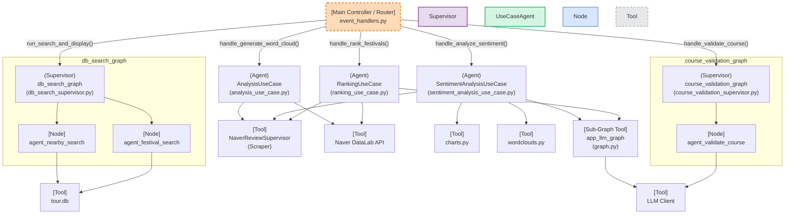

FestMoment: AI 축제 가이드 🤖✨
"축제의 순간을 AI로 재해석하다"

FestMoment는 전국 축제 데이터를 기반으로, LLM과 비전 모델을 활용해 ‘AI 축제 가이드’를 생성하는 서비스입니다. 기존의 축제 정보 서비스가 일정과 위치 중심이었다면, FestMoment는 후기와 이미지 속 감정 데이터에 주목합니다.

AI가 사람의 감정과 이미지를 재해석해 축제의 ‘순간’을 다시 느끼게 하는 새로운 경험을 제공합니다.

팀 이름: FestMoment

팀원: 염정운, 최가윤

🌟 주요 기능
FestMoment는 축제 검색부터 감성 분석, AI 이미지 생성까지 올인원(All-in-One) 경험을 제공합니다.

1. 📸 베스트 포토 & AI 렌더링
베스트 포토 추천: 네이버 블로그 후기의 이미지를 실시간으로 분석하여 축제의 특징을 가장 잘 보여주는 시각적 대표 사진을 자동으로 선정합니다.

AI 렌더링 포스터: 축제명과 베스트 포토를 조합하여 감성적인 영화 스타일의 포스터를 생성합니다.

AI 야경/계절 렌더링: TourAPI의 실제 위치 이미지와 운영 시간을 분석하여 축제의 계절(봄/여름/가을/겨울)과 시간대(낮/밤)를 판별합니다. Gemini Vision과 Google Static Maps API를 활용해 사실적이면서도 예술적인 축제 장면을 AI로 재구성합니다.

2. 🗺️ 축제 정보 및 다각적 검색
상세 정보: 축제의 기간, 장소, 요금, 주소, 개요 등 핵심 정보를 제공합니다.

계층적/지역별 검색: '자연과 계절 > 봄 축제'와 같은 카테고리별 탐색 및 시/도, 시/군/구 지역별 필터링을 통해 원하는 축제를 손쉽게 찾을 수 있습니다.

3. 📊 네이버 데이터 기반 AI 심층 분석
블로그 리뷰 AI 요약: AI가 네이버 블로그 후기들을 실시간으로 분석하여 축제의 장점, 단점, 방문 꿀팁을 세 가지 핵심 포인트로 요약합니다.

다차원 감성 분석 및 평점:

자체 구축한 감성 사전(규칙 기반)과 Google Gemini(LLM 동적 분석)를 결합하여 감성 점수를 도출하고 직관적인 별점을 제공합니다.

IQR(사분위수 범위)을 사용해 극단적인 이상치(Outlier) 리뷰를 필터링하여 객관적인 점수를 계산합니다.

검색량 트렌드 시각화: 네이버 데이터랩 API를 통해 연간 검색량 추이를 그래프로 시각화하여 축제에 대한 대중의 관심도 변화를 한눈에 파악하게 해줍니다.

계절별 워드클라우드: 블로그 후기에서 추출한 핵심 키워드를 계절 테마(봄, 여름, 가을, 겨울)에 맞는 마스크 이미지로 시각화하여 축제의 핵심 이미지를 감성적으로 전달합니다.

4. 🤖 개인 맞춤형 AI 가이드
AI 여행 가이드: 축제 방문 시 필요한 에티켓, 준비물, 주변 즐길 거리 등 사용자 맞춤형 가이드를 AI가 실시간으로 생성합니다.

객관적인 축제 랭킹: 사용자 평점, 리뷰 수, 검색량 트렌드 데이터를 가중치로 종합하여 가장 인기 있는 축제 순위를 객관적으로 제공합니다.

나만의 여행 코스 설계: 사용자가 관심 있는 축제나 장소를 담아 여행 일정을 만들면, AI가 해당 일정의 현실성(이동 시간, 동선)과 완성도를 검토하고 피드백을 제공합니다.

🛠️ 기술 스택 및 데이터 소스
주요 기술 스택
언어: Python

AI 프레임워크: LangGraph (계층적 에이전트 아키텍처)

LLM: Google Gemini

UI: Gradio

데이터 처리: Pandas, Konlpy (형태소 분석)

데이터 시각화: Matplotlib, Wordcloud

웹 스크래핑: Playwright, Selenium

데이터 소스
축제 정보: 한국관광공사 (TourAPI)

리뷰 및 트렌드: Naver Search API, Naver DataLab API

지도 및 위치: Google Static Maps API

자체 DB: 축제 분류 정보, 감성 분석용 사전 (dic/)

🚀 아키텍처 설계
본 프로젝트는 Python을 기반으로, LangGraph를 활용하여 각 기능 모듈을 자율적으로 수행하는 에이전트 아키텍처를 구축했습니다.

AI 에이전트 설계 (계층 구조)
LangGraph 프레임워크를 도입하여 시스템을 고도화했습니다. DB 검색, 네이버 리뷰 분석 등 각기 다른 역할을 수행하는 전문 에이전트(UseCase) 및 하위 슈퍼바이저(Graph)들을 두고, 상위의 컨트롤러(event_handlers.py)가 사용자 요청(Gradio UI)에 따라 작업을 분배하고 조율하는 계층적 구조로 설계되었습니다.

메인 컨트롤러 (event_handlers.py): Gradio UI의 버튼 클릭과 같은 이벤트를 받아, 어떤 하위 슈퍼바이저나 에이전트를 호출할지 결정하는 라우터 역할을 합니다.

DB 검색 슈퍼바이저 (db_search_supervisor.py): "축제 검색" 또는 "주변 추천" 요청을 받아 agent_festival_search나 agent_nearby_search 노드를 실행합니다.

코스 검증 슈퍼바이저 (course_validation_supervisor.py): "나만의 코스" 검증 요청을 받아 agent_validate_course 노드를 실행합니다.

핵심 에이전트 (UseCases): RankingUseCase, SentimentAnalysisUseCase 등 복잡한 비즈니스 로직(여러 도구와 그래프를 순차적/병렬적으로 호출)을 수행합니다.

핵심 하위 그래프 (graph.py): 여러 에이전트가 공용으로 사용하는 '리뷰 1개 분석' 그래프입니다. (검증 → 요약 → 점수 계산 → 피드백 루프)

LangGraph 계층 구조 다이어그램
(event_handlers.py를 메인 컨트롤러로 하는 현재 구현 기준)


```mermaid
graph TD
    %% --- 스타일 정의 ---
    style MainController fill:#FFDAB9,stroke:#F08A24,stroke-width:3px,stroke-dasharray: 5 5
    style Supervisor fill:#E8DAEF,stroke:#8E44AD,stroke-width:2px
    style UseCaseAgent fill:#D5F5E3,stroke:#28B463,stroke-width:2px
    style Node fill:#D6E6FF,stroke:#005AAB,stroke-width:1px
    style Tool fill:#E5E7E9,stroke:#5D6D7E,stroke-width:1px,stroke-dasharray: 5 5

    %% --- 1. 메인 컨트롤러 (A) ---
    MainController("[Main Controller / Router]\nevent_handlers.py")

    %% --- 2. 하위 작업자들 (B, C, D...) ---
    MainController -- "run_search_and_display()" --> Supervisor_DB["(Supervisor)\ndb_search_graph\n(db_search_supervisor.py)"]
    MainController -- "handle_validate_course()" --> Supervisor_Validate["(Supervisor)\ncourse_validation_graph\n(course_validation_supervisor.py)"]
    MainController -- "handle_rank_festivals()" --> Agent_Rank["(Agent)\nRankingUseCase\n(ranking_use_case.py)"]
    MainController -- "handle_analyze_sentiment()" --> Agent_Sentiment["(Agent)\nSentimentAnalysisUseCase\n(sentiment_analysis_use_case.py)"]
    MainController -- "handle_generate_word_cloud()" --> Agent_Analysis["(Agent)\nAnalysisUseCase\n(analysis_use_case.py)"]

    %% --- 3. Supervisor 내부 노드 (C1, C2...) ---
    
    subgraph "db_search_graph"
        Supervisor_DB --> Node_DB_Search["[Node]\nagent_festival_search"]
        Supervisor_DB --> Node_DB_Nearby["[Node]\nagent_nearby_search"]
    end

    subgraph "course_validation_graph"
        Supervisor_Validate --> Node_Validate["[Node]\nagent_validate_course"]
    end

    %% --- 4. Agent가 사용하는 도구 (D1, D2...) ---

    %% 랭킹 에이전트의 도구
    Agent_Rank --> Tool_Scraper["[Tool]\nNaverReviewSupervisor\n(Scraper)"]
    Agent_Rank --> Tool_Graph_LLM["[Sub-Graph Tool]\napp_llm_graph\n(graph.py)"]
    Agent_Rank --> Tool_NaverAPI["[Tool]\nNaver DataLab API"]

    %% 감성 분석 에이전트의 도구
    Agent_Sentiment --> Tool_Scraper
    Agent_Sentiment --> Tool_Graph_LLM
    Agent_Sentiment --> Tool_Charts["[Tool]\ncharts.py"]
    Agent_Sentiment --> Tool_WordClouds["[Tool]\nwordclouds.py"]
    
    %% 분석 에이전트의 도구
    Agent_Analysis --> Tool_Scraper
    Agent_Analysis --> Tool_NaverAPI

    %% 노드들의 공용 도구
    Node_DB_Search --> Tool_DB["[Tool]\ntour.db"]
    Node_DB_Nearby --> Tool_DB
    Node_Validate --> Tool_LLM["[Tool]\nLLM Client"]
    Tool_Graph_LLM --> Tool_LLM
```

폴더 구조 (클린 아키텍처 매핑)
.
├── app.py                  # 🔵 Presentation: 메인 실행 파일 (Gradio UI)
├── requirements.txt
├── tour.db                 # 🟢 Infrastructure: SQLite 데이터베이스
├── assets/                 # 🔵 Presentation: 정적 자산
├── database/               # 🟢 Infrastructure: DB 초기화용 CSV
├── dic/                    # 🟡 Domain: 감성 분석용 사전
├── src/
│   ├── application/        # 🟣 Application: 비즈니스 로직, 유스케이스
│   │   ├── agents/         # LangGraph 에이전트 노드 정의
│   │   ├── core/           # LangGraph 핵심 (State, Graph, Utils)
│   │   ├── supervisors/    # LangGraph 감독자 (라우터) 정의
│   │   └── use_cases/      # 복잡한 비즈니스 로직 (Agent)
│   ├── domain/             # 🟡 Domain: 핵심 비즈니스 규칙, 엔티티
│   │   └── knowledge_base.py # 감성 사전 로딩
│   ├── infrastructure/     # 🟢 Infrastructure: 외부 서비스, DB, 설정
│   │   ├── config/         # 환경 설정
│   │   ├── external_services/ # 외부 API 연동
│   │   ├── persistence/    # 데이터 영속성 (SQLite)
│   │   ├── reporting/      # 시각화 (Charts, Wordclouds)
│   │   ├── dynamic_scorer.py # 동적 감성 점수 계산
│   │   └── llm_client.py   # LLM 클라이언트 초기화
│   └── presentation/       # 🔵 Presentation: UI 로직
│       ├── callbacks.py    # UI 콜백 (드롭다운 연동 등)
│       ├── event_handlers.py # UI 이벤트 - Application 연결 (메인 컨트롤러)
│       └── ui.py           # Gradio UI 컴포넌트 정의
🏁 시작하기
1. 환경 설정
의존성 설치
requirements.txt 파일에 명시된 모든 Python 패키지를 설치합니다.

```bash
pip install -r requirements.txt
```
.env 파일 설정
프로젝트 루트 디렉토리(FestMoment/)에 .env 파일을 생성하고 다음 환경 변수를 설정합니다.

```
# Google Gemini API Key
GOOGLE_API_KEY="YOUR_GOOGLE_GEMINI_API_KEY"

# Naver API Keys for Blog Search
NAVER_CLIENT_ID="YOUR_NAVER_CLIENT_ID"
NAVER_CLIENT_SECRET="YOUR_NAVER_CLIENT_SECRET"

# Naver API Keys for DataLab Trend
NAVER_TREND_CLIENT_ID="YOUR_NAVER_TREND_CLIENT_ID"
NAVER_TREND_CLIENT_SECRET="YOUR_NAVER_TREND_CLIENT_SECRET"
```
2. 데이터베이스 설정
애플리케이션을 처음 실행할 때 app.py가 init_db()를 호출하여 database/ 폴더의 CSV 파일로부터 tour.db를 자동으로 생성합니다.

3. 애플리케이션 실행
프로젝트 루트 디렉토리에서 다음 명령어를 실행하여 Gradio 웹 인터페이스를 시작합니다.

```bash
python app.py
```
애플리케이션이 실행되면 웹 브라우저에서 http://127.0.0.1:7860 (또는 터미널에 표시되는 URL)로 접속하여 사용할 수 있습니다.