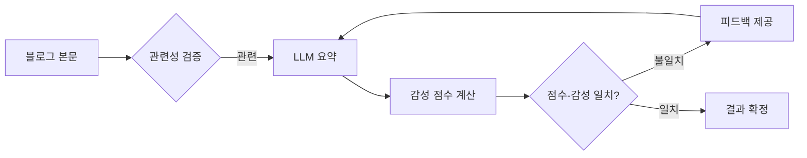
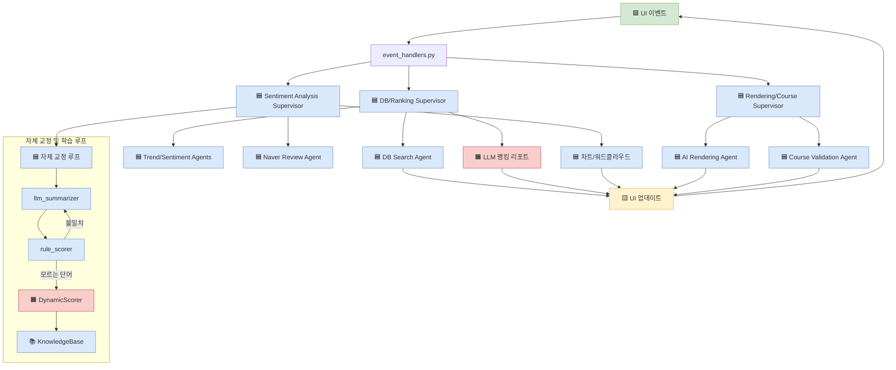
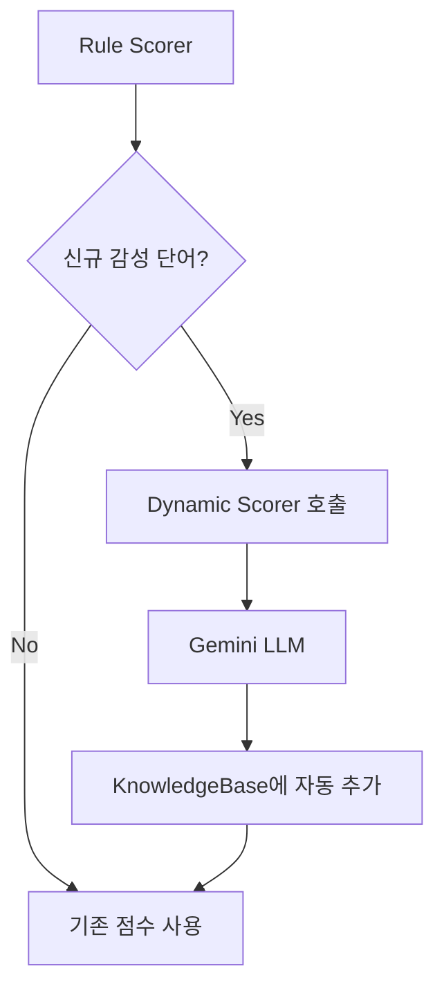

# 🎪 FestMoment: AI 축제 가이드

<div align="center">


### "축제의 순간을 AI로 재해석하다"

**데이터가 말해주는 진짜 축제 평가**
공공 데이터(TourAPI) × 민간 데이터(Naver Blog) × AI 감성 분석 × Vision 렌더링

[🚀 빠른 시작](#-빠른-시작) · [✨ 주요 기능](#-주요-기능) · [🏗️ 기술 아키텍처](#️-기술-아키텍처) · [📋 해커톤 신청서](#-2025년-새싹-해커톤-신청서) · [🎬 시연영상](#-시연영상)

---

### 🎥 서비스 시연

<div align="center">


</div>

**Team FestMoment** | 염정운, 최가윤

</div>

---

## 📋 목차

1. [🌟 프로젝트 소개](#-프로젝트-소개)
2. [🧐 Why FestMoment?](#-why-festmoment--왜-만들었나요)
3. [✨ 핵심 컨셉](#-the-magic--핵심-컨셉)
4. [🌟 주요 기능](#-주요-기능)
5. [🏗️ 기술 아키텍처](#️-기술-아키텍처)
6. [🛠️ 기술 스택](#️-기술-스택-및-데이터-소스)
7. [📋 2025년 새싹 해커톤 신청서](#-2025년-새싹-해커톤-신청서)
8. [🚀 빠른 시작](#-빠른-시작)
9. [📁 프로젝트 구조](#-프로젝트-구조-클린-아키텍처)
10. [💡 기대 효과](#-기대-효과-및-가치)
11. [🎬 시연영상](#-시연영상)
12. [🤝 기여하기](#-기여하기)
13. [📄 라이선스](#-라이선스)

---

## 🌟 프로젝트 소개

**FestMoment**는 전국의 축제 데이터를 기반으로, **LLM**과 **Vision 모델**을 활용해 'AI 축제 가이드'를 생성하는 올인원(All-in-One) 서비스입니다.

기존의 축제 정보 서비스가 일정과 위치 등 **정형적인 정보 제공**에 그쳤다면, FestMoment는 블로그 후기, 검색량 트렌드, 현장 이미지 등 **비정형 데이터 속에 담긴 감성**에 주목합니다.

### 💎 핵심 가치

- **🎭 감성 중심**: 사실(Fact)을 넘어, 축제의 분위기와 감정(Feeling)을 데이터로 전달
- **🤖 AI 주체-감성 분석**: "왜" 좋았는지(예: 음식, 포토존) / "왜" 나빴는지(예: 주차장, 대기줄)를 정량화
- **🎨 AI 시각화**: Vision 모델이 축제를 영화 포스터처럼 재창조하고, 계절/시간대별 이미지 생성
- **📊 데이터 기반 의사결정**: 검색량 트렌드 + 감성 점수 + IQR 이상치 필터링으로 객관적 평가
- **⚡ 자동화**: 수작업으로 수십 시간 걸릴 리뷰 분석을 단 몇 분 만에 완료

---

## 🧐 Why FestMoment? | 왜 만들었나요?

> **"축제 정보는 넘쳐나지만, 설렘은 어디에 있나요?"**

### 문제 인식

기존의 축제 앱들은 장소, 날짜, 가격 등 **사실(Fact)** 정보만 나열합니다. 하지만 우리가 정말 원하는 건 그 축제에 갔을 때 느낄 수 있는 **감성(Feeling)**과 **분위기**입니다.

- **정보의 파편화**: 축제 정보, 블로그 후기, 검색 트렌드가 모두 흩어져 있음
- **평가 지표 부재**: "방문객 수"라는 단편적 지표로만 성과 측정
- **감성 부재**: 실제 방문자의 생생한 경험과 감정이 데이터로 표현되지 않음

### 솔루션: FestMoment

**FestMoment**는 AI 기술을 통해 데이터 속에 숨겨진 사람들의 감정을 분석하고, 이미지를 재해석하여 축제의 순간을 **미리, 그리고 더 깊이** 느낄 수 있게 만듭니다.

---

## ✨ The Magic | 핵심 컨셉

FestMoment는 **3단계의 AI Magic**을 통해 축제에 감성을 불어넣습니다.

### 1️⃣ 데이터 융합 (Data Fusion)

**공공 데이터(TourAPI)**의 정형 정보와 **민간 데이터(Naver Blog)**의 비정형 리뷰/이미지를 결합하여 축제의 입체적인 모습을 구성합니다.

```
TourAPI (공공)          Naver Blog (민간)
├─ 축제 기본 정보      ├─ 실제 후기 (감성)
├─ 일정, 장소, 요금    ├─ 현장 이미지
└─ 공식 소개           └─ 방문 꿀팁
          ↓
      AI 융합 분석
          ↓
    입체적 축제 프로필
```

### 2️⃣ AI 감성 분석 (AI Sentiment Analysis)

**LLM(Gemini)**이 수많은 블로그 리뷰를 실시간으로 읽고, 사람들이 어떤 포인트에서 즐거워하고 아쉬워하는지 **감정의 맥락**을 파악합니다.

**핵심 기술**:
- **자가 교정 피드백 루프**: LLM과 규칙 기반 시스템이 서로 검증
- **동적 학습 감성 사전**: 신조어를 실시간으로 학습하여 사전 자동 확장
- **IQR 이상치 필터링**: 극단적 리뷰 제거로 객관성 확보

### 3️⃣ AI 시각화 (AI Visualization)

**Vision 모델**이 축제의 대표 이미지를 스스로 선정하고, 이를 **영화 포스터**처럼 재창조합니다.

- **베스트 포토 선정**: 블로그 이미지 중 축제 특징을 가장 잘 보여주는 사진 자동 선택
- **AI 렌더링 포스터**: 감성적인 영화 스타일 포스터 생성
- **계절/시간대별 렌더링**: 봄/여름/가을/겨울, 낮/밤 버전 이미지 AI 생성
- **AI 아이콘**: 축제의 핵심 상징을 담은 아이콘 생성

---

## 🌟 주요 기능

FestMoment는 축제 검색부터 감성 분석, AI 이미지 생성까지 **올인원(All-in-One)** 경험을 제공합니다.

### 1. 🔍 축제 검색 및 탐색

#### 다각적 검색 시스템
- **계층적 카테고리 검색**: '자연과 계절 > 봄 축제 > 벚꽃축제' 3단계 분류
- **지역별 필터링**: 시/도 → 시/군/구 2단계 지역 선택
- **진행 상태**: 전체 / 진행중 / 예정 / 종료
- **반응형 카드 UI**: 그리드 레이아웃, 호버 애니메이션, 상태 배지

#### 축제 상세 정보
- **기본 정보**: 축제명, 일정, 주소, 전화번호, 홈페이지, 이용요금
- **대표 이미지**: 고화질 히어로 섹션
- **상세 설명**: 행사 소개, 프로그램, 주요 볼거리

### 2. 💬 AI 심층 감성 분석

#### 블로그 리뷰 AI 분석
- **실시간 스크래핑**: Playwright로 Naver 블로그 본문 추출
- **관련성 검증**: Content Validator Agent가 광고성 블로그 필터링
- **AI 요약**: LLM이 **장점, 단점, 방문 꿀팁** 3가지 핵심 포인트 요약

#### 다차원 감성 분석
- **하이브리드 방식**: 규칙 기반(감성 사전) + LLM 기반(동적 분석) 결합
- **주체-감성 쌍 추출**: "음식(주체) - 맛있다(감성)" 형태로 구조화
- **IQR 이상치 필터링**: 극단적 리뷰(별점 테러) 제거
- **5단계 만족도**: 매우 불만족 ~ 매우 만족 분류

#### 자가 교정 피드백 루프

```mermaid
graph LR
    A[블로그 본문] --> B{관련성 검증}
    B -->|관련| C[LLM 요약]
    C --> D[감성 점수 계산]
    D --> E{점수-감성 일치?}
    E -->|불일치| F[피드백 제공]
    F --> C
    E -->|일치| G[결과 확정]
```

### 3. 📊 데이터 시각화

#### 만족도 차트
- **5단계 분포 차트**: IQR 통계로 레벨 분류
- **절대 점수 분포**: -2.0 ~ +2.0 범위 히스토그램
- **이상치 박스플롯**: 극단적 의견 식별
- **긍정/부정 도넛 차트**: 비율 시각화

#### 검색량 트렌드 시각화
- **연간 트렌드 그래프**: Naver DataLab API 기반
- **축제 기간 집중 분석**: ±30일 검색량 추이
- **트렌드 지수**: 행사 전 대비 행사 중 관심도 변화율

#### 테마별 워드클라우드
- **주체-감성 기반**: 단순 빈도가 아닌 "주체(Aspect)" 기반 추출
- **긍정/부정 분리**: 만족 요인 vs 불만 요인 구분
- **계절 마스크 이미지**: 봄(벚꽃), 여름(바다), 가을(단풍), 겨울(눈송이) 등 7가지 테마

### 4. 🎨 AI 렌더링 및 이미지 생성

#### 베스트 포토 & AI 포스터
- **이미지 자동 선정**: Gemini Vision이 블로그 이미지 중 대표 사진 선택
- **영화 포스터 스타일**: 감성적인 그래픽 디자인 AI 생성
- **AI 아이콘**: 축제 상징을 담은 심볼 아이콘 생성

#### 조건부 AI 렌더링
- **계절 렌더링**: 봄/여름/가을/겨울 4계절 이미지 생성
- **시간대 렌더링**: 낮/밤 2가지 시간대 이미지 생성
- **참조 기반 생성**: Google Static Maps API 위성 지도를 참조 이미지로 활용
- **Gemini 2.5 Flash**: 최신 이미지 생성 모델 사용

### 5. 🏆 객관적 축제 랭킹

#### 종합 점수 계산
```
최종 점수 = (감정 점수 × 0.5) + (트렌드 점수 × 0.3) + (정규화된 리뷰 수 × 0.2)
```

- **감정 점수 (50%)**: 긍정 문장 수 - 부정 문장 수 기반
- **트렌드 점수 (30%)**: 최근 7일 평균 검색량
- **리뷰 수 (20%)**: 유효한 블로그 리뷰 개수

#### LLM 랭킹 리포트
- 다차원 데이터를 LLM이 종합 분석하여 최종 평가 리포트 생성

### 6. 🗺️ 나만의 여행 코스

#### 코스 설계
- **추가/삭제**: 축제, 관광지, 여행 코스를 자유롭게 담기
- **순서 표시**: 번호 배지로 방문 순서 표시
- **LocalStorage 저장**: 브라우저에 자동 저장

#### AI 코스 검증
- **지오코딩**: Nominatim으로 주소 → 좌표 변환
- **거리 계산**: 위도/경도 기반 실제 이동 거리 산출
- **최적 순서 제안**: LLM이 이동 시간, 운영 시간, 관람 시간 고려하여 최적 동선 제안
- **일자별 상세 일정**: 여행 기간(당일~4박5일)에 맞춘 상세 스케줄 생성

### 7. 🗺️ 지도 기반 주변 추천

- **반경 설정**: 100m ~ 20km 범위 선택
- **주변 축제**: 인근 다른 축제 추천
- **주변 시설**: 관광지, 문화시설, 맛집 정보
- **여행 코스**: 테마별 추천 여행 경로

### 8. 👑 AI 에티켓 가이드

- **축제별 맞춤 주의사항**: LLM이 축제 특성 분석 후 안전 수칙, 매너, 준비물 제안
- **마크다운 포맷**: 구조화된 가이드라인 제공

---

## 🏗️ 기술 아키텍처

본 프로젝트는 Python을 기반으로, **LangGraph**를 활용하여 각 기능 모듈을 자율적으로 수행하는 **계층적 에이전트 아키텍처**를 구축했습니다.

### 시스템 구조

```
┌─────────────────────────────────────────┐
│   사용자 인터페이스                      │
│   └─ React Frontend (Port 3000)        │
└────────────────┬────────────────────────┘
                 │ HTTP/REST API
┌────────────────▼────────────────────────┐
│   FastAPI Backend (Port 8000)           │
│   ├─ RESTful API Endpoints              │
│   ├─ CORS Middleware                    │
│   └─ Request/Response Models            │
└────────────────┬────────────────────────┘
                 │ Function Calls
┌────────────────▼────────────────────────┐
│   LangGraph Agent System                │
│   ├─ Supervisors (라우터/조율자)        │
│   ├─ Use Cases (비즈니스 로직)          │
│   └─ Agents (실행 단위)                 │
└────────────────┬────────────────────────┘
                 │
┌────────────────▼────────────────────────┐
│   External Services & Data              │
│   ├─ Google Gemini LLM                  │
│   ├─ SQLite Database (tour.db)          │
│   ├─ Naver Blog/Trend API               │
│   └─ Google Maps API                    │
└─────────────────────────────────────────┘
```

### LangGraph 계층 구조


```mermaid
graph TD
    %% 입력 계층
    A[🟩 UI 이벤트] --> B[event_handlers.py]

    %% 슈퍼바이저 계층
    B --> C[🟦 DB/Ranking Supervisor]
    B --> D[🟦 Sentiment Analysis Supervisor]
    B --> E[🟦 Rendering/Course Supervisor]

    %% 에이전트 계층
    C --> F[🟦 DB Search Agent]
    C --> G[🟦 Trend/Sentiment Agents]
    C --> H[🟧 LLM 랭킹 리포트]

    D --> I[🟦 Naver Review Agent]
    D --> J[🟦 자체 교정 루프]
    D --> K[🟦 차트/워드클라우드]

    E --> L[🟦 AI Rendering Agent]
    E --> M[🟦 Course Validation Agent]

    %% 자체 교정 루프
    subgraph "자체 교정 및 학습 루프"
        J --> J1[llm_summarizer]
        J1 --> J2[rule_scorer]
        J2 -->|불일치| J1
        J2 -->|모르는 단어| J3[🟧 DynamicScorer]
        J3 --> J4[📚 KnowledgeBase]
    end

    %% 출력 계층
    F --> Z[🟨 UI 업데이트]
    H --> Z
    K --> Z
    L --> Z
    M --> Z

    Z --> A

    %% 스타일링
    classDef green fill:#D5E8D4,stroke:#82B366
    classDef blue fill:#DAE8FC,stroke:#6C8EBF
    classDef orange fill:#F8CECC,stroke:#B85450
    classDef yellow fill:#FFF2CC,stroke:#D6B656
    class A green
    class Z yellow
    class C,D,E,F,G,I,J,K,L,M,J1,J2,J4 blue
    class H,J3 orange
```

### 핵심 컴포넌트

#### 1. Supervisors (슈퍼바이저)
- **역할**: 특정 도메인 작업 조율 및 에이전트 실행
- **종류**:
  - `db_search_supervisor.py`: DB 검색 및 필터링
  - `course_validation_supervisor.py`: 여행 코스 검증 및 최적화

#### 2. Use Cases (유스케이스)
- **역할**: 복잡한 비즈니스 로직 수행
- **종류**:
  - `SentimentAnalysisUseCase`: 감성 분석 전체 프로세스
  - `RankingUseCase`: 축제 랭킹 계산
  - `RenderingUseCase`: AI 이미지 생성

#### 3. Agents (에이전트)
- **역할**: 단일 작업 수행
- **종류**:
  - `content_validator.py`: 블로그 관련성 검증
  - `llm_summarizer.py`: LLM 요약 및 주체-감성 쌍 추출
  - `rule_scorer.py`: 규칙 기반 점수 계산 및 피드백
  - `naver_review_agent.py`: Naver 블로그 스크래핑
  - `validation_agent.py`: 코스 검증

#### 4. Core (핵심 시스템)
- **LangGraph State**: 에이전트 간 데이터 공유
- **Workflow**: 검증 → 요약 → 점수 계산 → 피드백 루프

### 동적 학습 감성 사전

**가장 독창적인 핵심 기술**로, 시스템이 **스스로 학습하고 진화**합니다.


```mermaid
graph TD
    A[Rule Scorer] --> B{신규 감성 단어?}
    B -->|No| C[기존 점수 사용]
    B -->|Yes| D[Dynamic Scorer 호출]
    D --> E[Gemini LLM]
    E --> F[KnowledgeBase에 자동 추가]
    F --> C
```

**프로세스**:
1. Rule Scorer가 KnowledgeBase에 없는 신조어 발견 (예: "역대급이다")
2. Dynamic Scorer가 문맥과 단어를 Gemini에 전달하여 점수 추론
3. 추론된 점수(예: 1.8)를 `adjectives.csv`에 **자동 추가(append)**
4. **결과**: 앱을 사용할수록 감성 사전이 최신 언어 트렌드 학습

---

## 🛠️ 기술 스택 및 데이터 소스

### 백엔드 기술

| 분류 | 기술 | 버전 | 역할 |
|------|------|------|------|
| **언어** | Python | 3.11+ | 백엔드 핵심 언어 |
| **웹 프레임워크** | FastAPI | 0.115.0 | REST API 서버 |
| | Uvicorn | 0.32.0 | ASGI 웹 서버 |
| **AI 프레임워크** | LangGraph | 1.0.1 | 계층적 에이전트 아키텍처 |
| | LangChain | - | LLM 프롬프트 관리 |
| **LLM** | Google Gemini Pro | - | 감성 분석, 요약, 랭킹 |
| | Google Gemini Flash | - | 빠른 응답 |
| | Google Gemini Vision | - | 이미지 분석 |
| | Gemini 2.5 Flash | - | 이미지 생성 |
| **데이터 처리** | Pandas | 2.3.3 | 데이터프레임 조작 |
| | NumPy | - | 통계 계산 |
| **NLP** | KoNLPy (Okt) | 0.6.0 | 한국어 형태소 분석 |
| **데이터 시각화** | Matplotlib | 3.10.7 | 차트 생성 |
| | WordCloud | 1.9.4 | 워드클라우드 생성 |
| **웹 스크래핑** | Playwright | 1.55.0 | Naver 블로그 스크래핑 |
| | Selenium | - | 웹 자동화 |
| **데이터베이스** | SQLite | 3 | 로컬 DB |
| **지오코딩** | geopy | 2.4.1 | 주소 → 좌표 변환 |
| **이미지 처리** | Pillow | 11.3.0 | 이미지 조작 |

### 프론트엔드 기술

| 분류 | 기술 | 버전 | 역할 |
|------|------|------|------|
| **Framework** | React | 18.3.1 | UI 라이브러리 |
| **언어** | TypeScript | 5.2.2 | 타입 안정성 |
| **빌드 도구** | Vite | 5.3.1 | 초고속 빌드 및 HMR |
| **스타일링** | Tailwind CSS | 3.4.10 | 유틸리티 기반 CSS |
| **애니메이션** | Framer Motion | 11.5.4 | 페이지 전환 애니메이션 |
| **라우팅** | React Router | 6.26.0 | SPA 라우팅 |
| **상태 관리** | TanStack Query | 5.56.0 | 서버 상태 관리, 캐싱 |
| | Zustand | 4.5.5 | 클라이언트 상태 관리 |
| **HTTP 클라이언트** | Axios | 1.7.7 | API 통신 |
| **차트** | Recharts | 2.12.7 | 차트 라이브러리 |
| **아이콘** | React Icons | 5.3.0 | 아이콘 |
| **날짜 처리** | date-fns | 3.6.0 | 날짜 포맷팅 |

### 외부 API 및 데이터 소스

| 분류 | API/서비스 | 용도 |
|------|-----------|------|
| **축제 정보** | 한국관광공사 TourAPI | 축제 기본 정보, 일정, 위치 |
| **블로그 검색** | Naver Search API | 블로그 후기 검색 |
| **검색 트렌드** | Naver DataLab API | 연간 검색량 데이터 |
| **지도** | Google Static Maps API | 위성 지도 (AI 렌더링 참조) |
| **LLM** | Google Gemini API | 텍스트 분석, 이미지 생성 |
| **자체 DB** | SQLite | 축제 분류, 감성 사전 |

---

## 📋 2025년 새싹 해커톤 신청서

본 프로젝트는 **2025년 새싹 해커톤**에 제출된 AI 서비스입니다.

**기획서 위치**: 프로젝트 루트 디렉토리의 [`2025년 새싹 해커톤 AI 서비스 기획서 양식_최종.docx`](./2025년%20새싹%20해커톤%20AI%20서비스%20기획서%20양식_최종.docx) 파일에서 상세 내용을 확인하실 수 있습니다.

---

## 🚀 빠른 시작

### 📋 사전 준비

- **Python** 3.11 이상
- **Node.js** 18.0 이상, **npm** 9.0 이상
- **API 키**: Google Gemini, Naver Search, Naver DataLab (선택: Google Maps)

### ⚡ 실행 방법

#### 1. 의존성 설치

```bash
# Python 가상환경 생성 및 활성화
python -m venv venv
venv\Scripts\activate  # Windows
# source venv/bin/activate  # macOS/Linux

# Python 패키지 설치
pip install -r requirements.txt

# 프론트엔드 의존성 설치
cd frontend
npm install
cd ..
```

#### 2. 환경 변수 설정

프로젝트 루트에 `.env` 파일 생성:

```env
GOOGLE_API_KEY=your_google_gemini_api_key
NAVER_CLIENT_ID=your_naver_client_id
NAVER_CLIENT_SECRET=your_naver_client_secret
NAVER_TREND_CLIENT_ID=your_naver_trend_client_id
NAVER_TREND_CLIENT_SECRET=your_naver_trend_client_secret
```

#### 3. 서버 실행

```bash
# 터미널 1: 백엔드 서버 (http://localhost:8000)
python api_server.py

# 터미널 2: 프론트엔드 서버 (http://localhost:3000)
cd frontend
npm run dev
```

✅ 웹 브라우저에서 **http://localhost:3000** 접속!

---

## 📁 프로젝트 구조 (클린 아키텍처)

```
tour_agent/
├── 📄 api_server.py                    # FastAPI 백엔드 서버
├── 📄 requirements.txt                 # Python 의존성
├── 📄 .env                             # 환경 변수 (git ignore)
├── 📄 tour.db                          # SQLite 데이터베이스
├── 📄 2025년 새싹 해커톤 AI 서비스 기획서 양식_최종.docx
│
├── 📂 src/                             # 백엔드 소스코드
│   ├── 📂 application/                 # 🟣 Application Layer
│   │   ├── 📂 agents/                  # LangGraph 에이전트 노드
│   │   │   ├── 📂 common/
│   │   │   │   ├── content_validator.py    # Agent 1: 관련성 검증
│   │   │   │   ├── llm_summarizer.py       # Agent 2: LLM 요약 및 주체-감성 쌍 추출
│   │   │   │   └── rule_scorer.py          # Agent 3: 규칙 기반 점수 계산 및 피드백
│   │   │   ├── 📂 db_search/
│   │   │   │   ├── db_search_agent.py      # DB 검색 에이전트
│   │   │   │   └── nearby_search_agent.py  # 주변 추천 에이전트
│   │   │   ├── 📂 naver_review/
│   │   │   │   └── naver_review_agent.py   # Naver 블로그 스크래핑
│   │   │   ├── 📂 course_validation/
│   │   │   │   └── validation_agent.py     # 코스 검증 에이전트
│   │   │   └── precaution_agent.py         # 주의사항 생성 에이전트
│   │   │
│   │   ├── 📂 core/                    # LangGraph 핵심 구조
│   │   │   ├── state.py                # LLMGraphState (개별 블로그 분석 상태)
│   │   │   ├── db_state.py             # DBSearchState (검색 상태)
│   │   │   ├── graph.py                # app_llm_graph (메인 워크플로우)
│   │   │   ├── constants.py            # 상수 정의
│   │   │   └── utils.py                # 유틸리티
│   │   │
│   │   ├── 📂 supervisors/             # LangGraph 슈퍼바이저
│   │   │   ├── db_search_supervisor.py         # DB 검색 라우터
│   │   │   └── course_validation_supervisor.py # 코스 검증 라우터
│   │   │
│   │   ├── 📂 use_cases/               # 복잡한 비즈니스 로직
│   │   │   ├── sentiment_analysis_use_case.py  # 감성 분석 유스케이스
│   │   │   ├── ranking_use_case.py             # 랭킹 유스케이스
│   │   │   ├── rendering_use_case.py           # AI 렌더링 유스케이스
│   │   │   └── analysis_use_case.py            # 분석 유스케이스
│   │   │
│   │   └── 📂 services/                # 비즈니스 서비스
│   │       ├── festival_service.py
│   │       ├── facility_service.py
│   │       └── course_service.py
│   │
│   ├── 📂 domain/                      # 🟡 Domain Layer
│   │   ├── knowledge_base.py           # 감성 분석용 사전 로딩
│   │   └── entities.py                 # 도메인 엔티티
│   │
│   ├── 📂 infrastructure/              # 🟢 Infrastructure Layer
│   │   ├── 📂 config/                  # 환경 설정
│   │   │   ├── settings.py             # 환경변수 로드
│   │   │   └── loader.py               # 데이터 로더
│   │   │
│   │   ├── 📂 external_services/       # 외부 API
│   │   │   └── 📂 naver_search/
│   │   │       └── naver_review_api.py # Naver Blog 검색, DataLab API
│   │   │
│   │   ├── 📂 persistence/             # 데이터 영속성
│   │   │   ├── database.py             # SQLite 초기화 및 로드
│   │   │   └── inspect_db.py           # DB 검사
│   │   │
│   │   ├── 📂 reporting/               # 시각화
│   │   │   ├── charts.py               # 차트 생성
│   │   │   └── wordclouds.py           # 워드클라우드
│   │   │
│   │   ├── dynamic_scorer.py           # 동적 감성 점수 계산
│   │   └── llm_client.py               # Google Gemini LLM 클라이언트
│   │
│
├── 📂 frontend/                        # React 프론트엔드 ⭐
│   ├── 📂 src/
│   │   ├── 📂 components/              # 재사용 가능한 컴포넌트
│   │   │   ├── 📂 layout/              # Header, Footer, Layout
│   │   │   ├── 📂 search/              # SearchFilters
│   │   │   └── 📂 festival/            # FestivalCard
│   │   │
│   │   ├── 📂 pages/                   # 페이지 컴포넌트
│   │   │   ├── HomePage.tsx
│   │   │   ├── SearchPage.tsx
│   │   │   ├── FestivalDetailPage.tsx
│   │   │   └── MyCoursePage.tsx
│   │   │
│   │   ├── 📂 lib/                     # 유틸리티
│   │   │   ├── api.ts                  # API 클라이언트
│   │   │   └── utils.ts                # 헬퍼 함수
│   │   │
│   │   ├── 📂 store/                   # 상태 관리
│   │   │   └── useCourseStore.ts       # Zustand 스토어
│   │   │
│   │   ├── 📂 types/                   # TypeScript 타입
│   │   ├── App.tsx                     # 메인 앱
│   │   ├── main.tsx                    # 진입점
│   │   └── index.css                   # 글로벌 스타일
│   │
│   ├── 📄 package.json
│   ├── 📄 vite.config.ts
│   ├── 📄 tsconfig.json
│   ├── 📄 tailwind.config.js
│   └── 📄 index.html
│
├── 📂 database/                        # DB 초기화용 CSV
├── 📂 dic/                             # 감성 분석용 사전 (동적 학습)
│   ├── idioms.csv                      # 관용어
│   ├── adjectives.csv                  # 감성 형용사
│   ├── adverbs.csv                     # 감성 부사
│   ├── sentiment_nouns.csv             # 감성 명사
│   ├── amplifiers.csv                  # 강조어
│   ├── downtoners.csv                  # 완화어
│   └── negators.csv                    # 부정어
│
├── 📂 festivals/                       # 축제 카테고리 JSON
├── 📂 assets/                          # 정적 자산 (워드클라우드 마스크 등)
├── 📂 best_images_and_icons/          # 축제별 대표 이미지 및 아이콘
```

---

## 💡 기대 효과 및 가치

### 사회적 효과

- **문화 경험의 디지털화**: AI가 한국의 문화유산을 시각적으로 재해석하여, 외국인 관광객에게 **한국 문화의 감정적 경험** 제공
- **문화 아카이빙**: 축제의 감성을 데이터로 보존하여 미래 세대에 전달
- **접근성 향상**: 장애인, 원거리 거주자도 AI 렌더링으로 축제 경험 가능

### 경제적 효과

- **데이터 기반 홍보**: 감성 분석 데이터로 효과적인 마케팅 전략 수립
- **관광객 유치**: 생생한 AI 렌더링 이미지로 방문 유도
- **서울 경제 활성화**: 축제 방문객 증가 → 지역 상권 활성화

### 기술적 가치

- **공공-민간 데이터 융합 모델**: TourAPI + Naver Blog 결합 사례
- **LangGraph 기반 에이전트 시스템**: 자율 에이전트의 새로운 표준 제시
- **동적 학습 시스템**: 신조어 자동 학습으로 지속 가능한 AI 시스템 구축

### 사용자 가치

| 사용자 유형 | 제공 가치 |
|------------|---------|
| **일반 관광객** | 축제 분위기를 미리 경험, 코스 최적화로 효율적 여행 |
| **축제 기획자** | 데이터 기반 개선 방향 도출, 객관적 성과 평가 |
| **지자체** | 예산 배분 근거 마련, 타 지역 벤치마킹 |
| **마케터** | 타깃 맞춤형 홍보 전략, 트렌드 분석 |
| **연구자** | 문화 관광 데이터 연구 자료, 감성 분석 방법론 |

---

## 🎬 시연영상

### 📺 실시간 시연 (GIF)

<div align="center">


</div>

### 🎥 전체 시연영상 (동영상)

**📺 시연영상 링크**: [Google Drive에서 보기](https://drive.google.com/file/d/19p36hZKksQczgAepus1-n4y4W_z3rrlf/view?usp=sharing)

### 주요 시연 내용

- **🔍 축제 검색 및 필터링**: 계층적 카테고리, 지역별, 진행 상태별 검색
- **💬 AI 감성 분석**: 블로그 리뷰 → LLM 요약 → 차트/통계 시각화
- **☁️ 워드클라우드 생성**: 주체-감성 기반 키워드 추출, 테마별 마스크 이미지
- **🎨 AI 렌더링 이미지**: Vision 모델로 축제 포스터 및 계절별 이미지 생성
- **🗺️ 여행 코스 설계**: 나만의 코스 담기 + AI 최적 동선 검증
- **🏆 객관적 랭킹 시스템**: 감정 점수 + 트렌드 점수 + 리뷰 수 종합 평가

---

## 🤝 기여하기

**FestMoment**는 오픈소스 프로젝트입니다. 기여를 환영합니다!

### 기여 방법

1. 이 저장소를 Fork합니다
2. 새로운 기능 브랜치를 생성합니다 (`git checkout -b feature/AmazingFeature`)
3. 변경사항을 커밋합니다 (`git commit -m 'Add some AmazingFeature'`)
4. 브랜치에 Push합니다 (`git push origin feature/AmazingFeature`)
5. Pull Request를 생성합니다

### 개선 아이디어

- [ ] 추가 차트 타입 (히트맵, 산점도 등)
- [ ] 멀티모달 분석 (텍스트 + 이미지 동시 분석)
- [ ] 다국어 지원
- [ ] 모바일 앱 (React Native)
- [ ] 실시간 알림 (새로운 리뷰 감지)
- [ ] 데이터 소스 확장 (Instagram, Twitter, 카카오맵 리뷰)

---

## 📄 라이선스

© 2025 FestMoment. All rights reserved.

### 팀 정보

**Team FestMoment**
- 염정운 (Backend Lead, LangGraph Architect)
- 최가윤 (Frontend Lead, UI/UX Designer)

### 사용 제한

- ❌ **상업적 사용 금지**: 본 소프트웨어를 판매하거나 유료 서비스로 제공할 수 없습니다
- ❌ **라이선스 제거 금지**: 본 README의 출처 표시를 제거할 수 없습니다

### 허용 사항

- ✅ **개인 학습 및 연구**: 자유롭게 사용 가능
- ✅ **수정 및 배포**: Fork하여 개선하고 공유 가능 (출처 명시 필수)
- ✅ **관공서/비영리 사용**: 공익 목적의 무료 사용 가능

### 데이터 출처

- **축제 정보**: 한국관광공사 TourAPI
- **블로그 데이터**: Naver Search API
- **검색 트렌드**: Naver DataLab API
- **지도**: Google Static Maps API

---

<div align="center">

**Made with ❤️ for Festival Lovers**

⭐ 이 프로젝트가 도움이 되셨다면 Star를 눌러주세요!

[⬆️ 맨 위로 돌아가기](#-festmoment-ai-축제-가이드)

---

**📞 문의**
📧 ericyum9196@gmail.com

</div>
